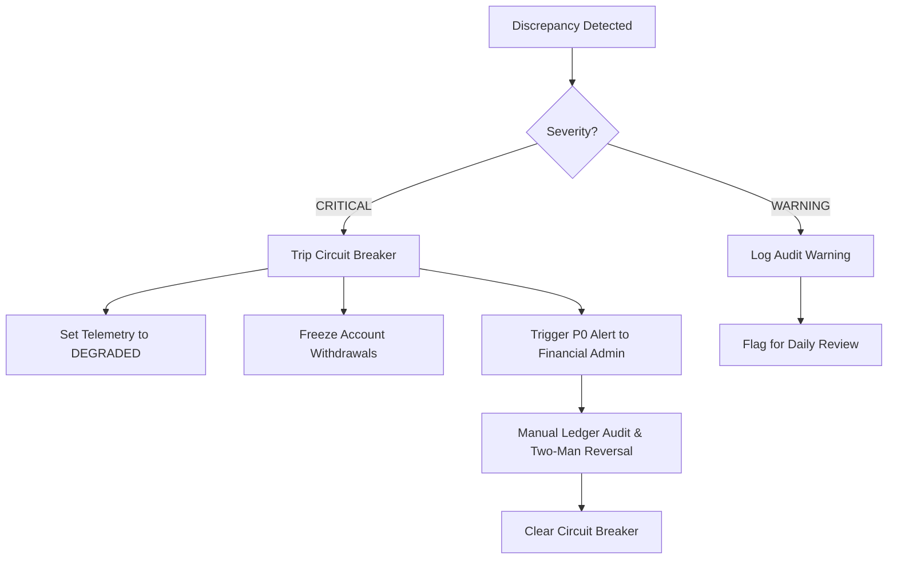

# Operational Runbook: Supabase Architecture & Financial Reconciliation

**Document Version:** 1.0.0  
**Effective Date:** September 2026  
**Applicability:** Production & Staging Environments — Crypto Index Asset Platform  
**Scope:** Supabase Authentication, PostgreSQL Database, Double-Entry Financial Ledger, Storage Workflows, Market Data Pricing, and Production Operations.

---

## 1. System Architecture & Topology

The platform integrates modern frontend web clients with PostgreSQL via Prisma ORM and Supabase managed services:

```
+-----------------------------------------------------------------------------------+
|                                 CLIENT PORTALS                                    |
|   +--------------------+   +-----------------------+   +----------------------+   |
|   |  Public Marketing  |   |  Customer Dashboard   |   |   Admin Control      |   |
|   |  (/, /about, etc.) |   |  (/dashboard, etc.)   |   |   (/admin, etc.)     |   |
|   +--------------------+   +-----------------------+   +----------------------+   |
+-----------------------------------------------------------------------------------+
                                          |
                                          v
+-----------------------------------------------------------------------------------+
|                        NEXT.JS 15 RUNTIME & MIDDLEWARE                            |
|   - middleware.ts: Public route pass-through, /api/health bypass                  |
|   - lib/supabase/middleware.ts: Session revalidation & role-based route gating    |
|   - lib/dashboard/mutations.server.ts: Strict user-scoped financial operations    |
|   - lib/admin/reconciliation.server.ts: Cryptographic invariant auditing         |
|   - lib/market/service.ts: Cached CoinGecko quote feed with safe reference fallback|
+-----------------------------------------------------------------------------------+
                                          |
                      +-------------------+-------------------+
                      |                                       |
                      v                                       v
+------------------------------------+  +-------------------------------------------+
|          SUPABASE SERVICES         |  |         POSTGRESQL FINANCIAL LEDGER       |
|  - Auth (GoTrue): JWT / MFA        |  |  - users, wallets, ledger_entries        |
|  - Storage: S3-compatible buckets  |  |  - transactions (idempotent, audit-logged)|
|    * public: trader portraits      |  |  - copy_traders, user_copy_trades        |
|    * private: kyc & payment proofs |  |  - trading_signals, audit_logs           |
+------------------------------------+  +-------------------------------------------+
```

---

## 2. Pre-Cutover & Migration Checklist

Before switching production traffic to the new architecture or releasing financial write operations:

### Phase 1: Pre-Cutover Audit (Staging)
1. **Schema Parity Verification**:
   ```bash
   npx prisma validate
   npx prisma migrate status
   ```
2. **Legacy User & Balance Alignment**:
   Run the migration auditor to ensure zero duplicate emails and zero orphaned records:
   ```bash
   node scripts/migrate-legacy-auth.mjs
   ```
   - Verify aggregate currency balances match legacy database totals exactly.
   - Verify all users have active or provisionable Supabase Auth profiles.
3. **Double-Entry Ledger Opening Balances**:
   Run the reconciliation engine in dry-run mode, then apply the opening balance backfill:
   ```bash
   node scripts/reconcile-ledger.mjs --dry-run
   node scripts/reconcile-ledger.mjs --auto-backfill-opening
   ```
   Verify status returns `CLEAN` or `CORRECTED` with 0 critical issues.

### Phase 2: Live Cutover Execution
1. **Freeze Legacy Writes**:
   Set legacy application endpoints to read-only maintenance mode.
2. **Execute Final Delta Synchronization**:
   Copy any pending transactions recorded between staging dump and cutover freeze.
3. **Run Final Reconciliation**:
   ```bash
   node scripts/reconcile-ledger.mjs
   ```
   **STOP:** If `reconcile-ledger.mjs` exits with code 1, DO NOT release customer-facing financial buttons.
4. **Deploy Application & Point DNS**:
   Release Next.js production build (`npm run build && npm start`).
5. **Verify Endpoint Liveness & Telemetry**:
   ```bash
   curl -I https://app.cryptoindexasset.com/api/health
   curl -H "x-healthcheck-token: $HEALTHCHECK_SECRET" https://app.cryptoindexasset.com/api/health?detailed=true
   ```

---

## 3. Financial Invariants & Circuit-Breaker Protocol

### Invariants Enforced by `reconcile-ledger`
1. **Balance Invariant**:
   $$\text{Wallet.balance} = \sum \text{LedgerEntry.CREDIT} - \sum \text{LedgerEntry.DEBIT}$$
2. **Reservation Invariant**:
   $$\text{Wallet.reserved} = \sum \text{Pending Withdrawal (Amount + Fee)} + \sum \text{Active/Paused Copy Trade Holds}$$
3. **Non-Negativity Invariant**:
   $$\text{Wallet.balance} \ge 0 \quad \text{and} \quad \text{Wallet.reserved} \ge 0 \quad \text{and} \quad \text{Wallet.balance} \ge \text{Wallet.reserved}$$
4. **Conservation of Assets**:
   Sum of user balances + pending reservations + cold custody reserves must balance across all supported assets.

### Circuit-Breaker Actions & Incident Response

When an invariant discrepancy is detected:



1. **Automatic Containment**:
   - The reconciliation engine logs an `AuditLog` entry with action `CIRCUIT_BREAKER_ALERT`.
   - The `/api/health` diagnostic reports `circuitBreakerActive: true` and flips system status to `degraded` (HTTP 503).
   - The affected wallet's withdrawal capabilities are held until reviewed.
2. **Triage Procedure**:
   - Query the specific wallet's ledger history:
     ```bash
     node scripts/reconcile-ledger.mjs --user <user_id> --json
     ```
   - Inspect recent `transactions` and `ledger_entries` for race conditions, failed third-party settlement, or duplicate submission.
3. **Remediation**:
   - If an unauthorized balance mutation occurred, execute an audited offsetting entry through `lib/admin/financials.server.ts` (`adjustUserBalanceAction`) requiring a second administrator review.
   - Re-run `node scripts/reconcile-ledger.mjs --user <user_id>` to confirm the invariant is restored.

---

## 4. Daily Operational Schedules & Cron Jobs

| Schedule | Job / Command | Description | Threshold / Alert Condition |
|---|---|---|---|
| **Every 1 Minute** | `GET /api/health` | Public uptime probe (Pingdom / Cloudflare) | Non-200 response > 2 consecutive checks |
| **Every 5 Minutes** | `GET /api/health?detailed=true` | Authenticated subsystem health probe | DB latency > 500ms, quote feed stale > 10m |
| **Daily at 03:00 UTC** | `node scripts/reconcile-ledger.mjs` | Automated financial ledger audit | Any discrepancy $\to$ P0 alert |
| **Daily at 04:00 UTC** | PostgreSQL `pg_dump` & WAL Archiving | Full cold backup of PostgreSQL schema & rows | Backup exit code $\ne$ 0 or size < 90% of yesterday |
| **Weekly (Sunday)** | `node scripts/migrate-legacy-auth.mjs` | User sync & orphaned row audit | Any orphaned wallet or unlinked user |

---

## 5. Third-Party Outage & Degraded Modes

### Scenario A: CoinGecko Upstream Outage / Rate-Limiting
- **Behavior**: `lib/market/service.ts` uses an in-memory cache with a 60s TTL and a 3.5s timeout. If CoinGecko is unavailable or returns 429, the service serves cached quotes for up to 10 minutes (`stale-while-revalidate`).
- **If outage exceeds 10 minutes**:
  - The service serves verified baseline reference quotes with explicit `isStale: true` indicators.
  - The customer dashboard displays clear disclaimer banners indicating estimates are based on historical reference data.
  - **No financial execution takes place on unverified prices.**

### Scenario B: Supabase Auth Intermittent Outage
- **Behavior**: Customer sessions are validated via JWT tokens cached in HTTP-only secure cookies. Short transient network blips do not immediately invalidate active authenticated sessions.
- **Recovery**: If GoTrue service experiences prolonged outage, monitor `app/api/health` and verify Supabase incident status at `https://status.supabase.com`.

### Scenario C: Supabase Storage Upload Failures
- **Behavior**: KYC documents and payment proof uploads generate short-lived signed URLs. If upload fails, `mutations.server.ts` records the failure cleanly without corrupting user balance or transaction state.
- **Recovery**: Customers are prompted to retry with automatic image re-encoding (max 10MB, JPEG/PNG).

---

## 6. Two-Man Rule for Manual Financial Adjustments

Any manual credit or debit executed by an administrator:
1. Must specify an explicit `reason`, linked transaction ID, and administrative actor.
2. If the adjustment exceeds **$1,000.00 USD** (or equivalent in crypto):
   - The adjustment is placed into `PENDING_REVIEW` status.
   - A second administrator with `SUPERADMIN` privileges must approve the entry via the Admin Portal before funds are credited.
3. Every manual adjustment writes an immutable `LedgerEntry` and creates a corresponding `AuditLog` entry storing `before` and `after` balance states.

---

## 7. Disaster Recovery & Backup Procedures

### PostgreSQL Database Restore Drill
1. Verify latest backup file from secure cold storage:
   ```bash
   aws s3 ls s3://cia-db-backups/daily/
   ```
2. Test restoration into isolated staging environment:
   ```bash
   pg_restore --clean --if-exists -d postgresql://staging_db_url backup_YYYY-MM-DD.dump
   ```
3. Run post-restore verification:
   ```bash
   npx prisma migrate status
   node scripts/reconcile-ledger.mjs
   ```
   Confirm all ledger invariants pass 100%.

---

## 8. Incident Roles & Escalation Matrix

| Role | Primary Responsibility | Primary Escalation Contact |
|---|---|---|
| **Lead Application / Auth Owner** | Next.js runtime, authentication sessions, route protection | engineering@cryptoindexasset.com |
| **Database & Backup Owner** | PostgreSQL performance, migrations, backup & recovery | dba@cryptoindexasset.com |
| **Financial Reconciliation Owner** | Ledger integrity, circuit breaker clearance, balance audits | finance-ops@cryptoindexasset.com |
| **Publication & Content Approver** | Trader metrics, signals validation, marketing compliance | compliance@cryptoindexasset.com |
